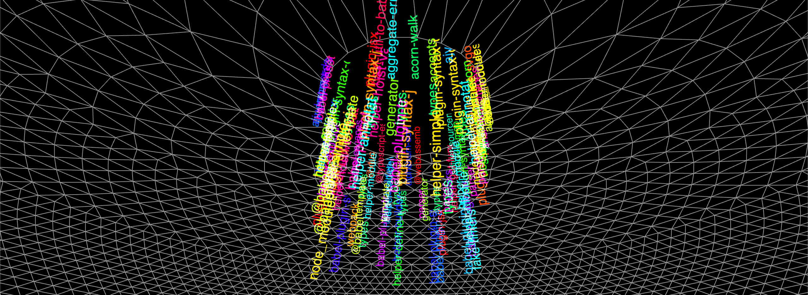

# super-silly-vortex

A silly recreation of the Rain Vortex at Jewel Changi Airport, but it’s `node_modules` instead of water.
Made at [Super Silly Hackathon 2019](https://supersillyhackathon.sg/).

### &rarr; [Video presentation](https://www.youtube.com/watch?v=34o10hsWovI) @ [Super Silly Hackathon](https://supersillyhackathon.sg/).

### &rarr; [About this project](https://www.notion.so/dtinth/super-silly-vortex-f42731e7e2304b97852e69a3797231b0)

### &rarr; [Presentation slides](./presentation/README.md)

### &rarr; [Demo](https://super-silly-vortex.netlify.com/)
